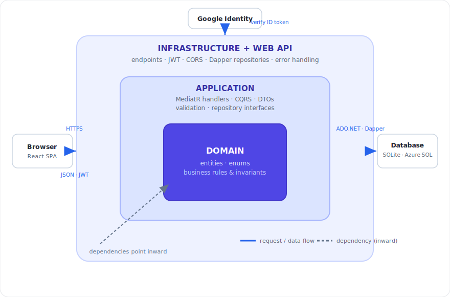

# Todo App — .NET 10 Clean Architecture + React (Dapper edition)

A full-stack, multi-user **Kanban board** — tasks flow across To Do / In Progress / Done lanes as
draggable, category-colored post-it notes. The backend is an ASP.NET Core Web API organized with Clean
Architecture (Domain / Application / Infrastructure / WebApi) using CQRS (MediatR), FluentValidation, and
**Dapper** over SQLite / Azure SQL. Authentication is JWT-based with refresh-token rotation and
**revocable tokens** for compromised accounts. The frontend is a React (Vite) single-page app.

> ### 🔀 This is the `refactor/dapper` branch
> Same app as [`main`](https://github.com/bgard68/ToDoApp/tree/main), with the **persistence layer rebuilt on Dapper instead of EF
> Core**. The domain model, API contract, auth, and frontend are unchanged — only the data layer differs.
> Both branches deploy to the same Azure App Service on demand (see [Workflows](docs/workflows.md)).
> New to the swap? Start with **[Architecture](docs/architecture.md)** and the
> **[Bugs encountered log](docs/refactor-bugs.md)**.

<p align="center">
  
</p>

## Highlights

- **Kanban board** — three lanes (To Do / In Progress / Done) with native HTML5 drag-and-drop to change
  a task's status, tasks shown as post-it notes colored by category, a check mark on Done cards, and a
  category filter.
- **User-managed categories** — each user creates, renames, recolors, and deletes their own categories,
  with a starter set seeded on sign-up. Deleting a category leaves its tasks uncategorized (`ON DELETE
  SET NULL`) rather than removing them.
- **Clean Architecture + CQRS** — dependencies point inward (WebApi → Infrastructure → Application →
  Domain); handlers depend on **repository interfaces**, not Dapper or ASP.NET.
- **Hand-written SQL via Dapper** — focused repositories, an explicit unit-of-work transaction for
  multi-write flows, optimistic concurrency as `UPDATE … WHERE ConcurrencyToken = @expected`, and an
  idempotent schema initializer that runs per-dialect DDL for SQLite and SQL Server.
- **JWT auth with real revocation** — short-lived access tokens carry a per-user security stamp; refresh
  tokens are hashed, single-use, and rotated with reuse detection. "Sign out everywhere" instantly
  invalidates all sessions.
- **Google sign-in**, **per-user authorization** (cross-user access returns 404), **optimistic
  concurrency** (conflicting edits surface as 409), and **testable time** (`IDateTimeProvider`).
- **Tested** — 36 xUnit unit tests (domain + handlers over real in-memory SQLite through the
  repositories) + 17 `WebApplicationFactory` integration tests, plus a 37-check PowerShell smoke test
  that hits every endpoint (including Google via a dev-only fake identity). SQL Server verified on LocalDB.
- **Deployable** — Azure (App Service + Static Web Apps) with passwordless SQL and Key Vault, via GitHub
  Actions (OIDC).

**Tech stack (at a glance):**

- **Backend:** .NET 10 · ASP.NET Core Minimal APIs · Clean Architecture + CQRS (MediatR) · FluentValidation · **Dapper** · Swagger
- **Frontend:** React 18 · Vite 5 · custom hooks · `fetch`-based API client · Google Identity Services
- **Data:** SQLite (dev) / Azure SQL (prod) via a config-driven provider switch, hand-written SQL
- **Auth:** JWT · refresh-token rotation + reuse detection · security-stamp revocation · PBKDF2 · Google sign-in · Key Vault
- **Testing:** xUnit + FluentAssertions + `WebApplicationFactory` (backend) · PowerShell smoke test
- **Hosting & CI/CD:** Azure App Service · Azure SQL · Static Web Apps · GitHub Actions (OIDC)

## Project layout

```
TodoApp.sln
src/
  TodoApp.Domain/          # Entities (User, RefreshToken, TodoItem, Category), enums, business rules
  TodoApp.Application/     # CQRS commands/queries, DTOs, validation, repository interfaces
  TodoApp.Infrastructure/  # Dapper repositories, connection factory, unit of work, schema initializer, JWT/auth
  TodoApp.WebApi/          # Minimal API endpoints, JWT wiring, error handling

# The React + Vite client now lives on its own standalone `frontend` branch,
# not in this branch. See "Frontend" below.
```

Dependencies point inward: WebApi → Infrastructure → Application → Domain. The Application layer defines
interfaces (`ITodoRepository`, `IUnitOfWork`, `IJwtTokenService`, `IPasswordHasher`, `ICurrentUserService`,
`IDateTimeProvider`) that Infrastructure implements, so the core has no direct dependency on Dapper or
ASP.NET.



Solid arrows are the request/data flow; the dashed arrow is **dependency inversion** — the Application
defines the repository interfaces and Infrastructure implements them with Dapper, which is why the same
handlers run unchanged on SQLite locally and Azure SQL in production. Full walkthrough:
**[Architecture](docs/architecture.md)** and **[Infrastructure](docs/infrastructure.md)**.

## Quick start

```bash
# Backend (http://localhost:5080, Swagger at /swagger)
dotnet restore
dotnet user-secrets set "Jwt:Key" "$(openssl rand -base64 48)" --project src/TodoApp.WebApi
dotnet run --project src/TodoApp.WebApi

# Frontend (http://localhost:5173) — lives on the standalone `frontend` branch.
# Check it out once into a sibling folder, then run it in a second terminal:
git worktree add ../todoapp-frontend frontend
cd ../todoapp-frontend && npm install && npm run dev
```

> **Frontend location.** The React + Vite client is maintained on its own `frontend`
> branch (app at the branch root) and deploys to Azure Static Web Apps from there — shared
> by both the EF Core (`main`) and Dapper (`dapper`) backends. It is intentionally not part
> of this branch. Use `git checkout frontend` or the `git worktree` command above.

First backend run creates a SQLite database (`todoapp.db`) via the schema initializer and seeds a demo
user (`demo@todoapp.local` / `Password123!`). The JWT signing key **must** be supplied externally — the
app fails fast without it.

## Testing

`dotnet test` runs the xUnit unit + integration suites with no setup. For an end-to-end health check that
hits **every** API endpoint over HTTP against a running instance — including Google sign-in via a
Development-only fake identity — run the **[API smoke test](scripts/README.md)** (note a green run is a
mix of expected status codes: `200`, plus deliberate `401`/`400`/`409`/`204`, not all `200`). Full
details in the **[testing guide](docs/testing.md)**.

## Documentation

- **[Architecture](docs/architecture.md)** — the onion/Clean-Architecture layering, dependency inversion via repositories, and what changed from the EF Core version.
- **[Infrastructure (Dapper data layer)](docs/infrastructure.md)** — repositories, connection factory, unit of work, type handlers, schema initializer, and the dual-provider dialect differences.
- **[Workflows & deploys](docs/workflows.md)** — the GitHub Actions workflows, the deploy gate, and how to run them — including the EF ↔ Dapper branch-choice deploy to Azure.
- **[Testing](docs/testing.md)** — the unit / integration / smoke layers, the rebuilt Dapper test harness, and the fake-Google flow.
- **[Bugs encountered](docs/refactor-bugs.md)** — the real problems hit during the refactor and smoke test, with root cause and fix for each.
- **[Azure deployment](docs/deployment/azure.md)** — start-to-finish Azure runbook (App Service, passwordless Azure SQL, Static Web Apps, Google sign-in, CORS, Key Vault), plus how to point `refactor/dapper` at Azure.
- **[API smoke test](scripts/README.md)** — the PowerShell end-to-end check and how to run it with the fake Google validator.

> The EF Core version and its full deployment/architecture deep-dives (Key Vault, Google sign-in setup,
> database portability, infrastructure-as-code, troubleshooting log) live on the [`main`](https://github.com/bgard68/ToDoApp/tree/main)
> branch.
