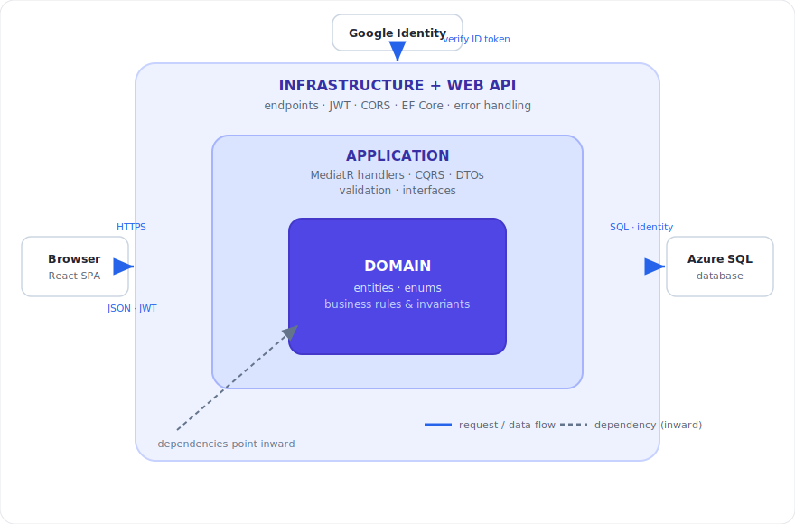

# Todo App — .NET 10 Clean Architecture + React (with JWT Auth)

A full-stack, multi-user **Kanban board** — tasks flow across To Do / In Progress / Done
lanes as draggable, category-colored post-it notes. The backend is an ASP.NET Core Web API
organized with Clean Architecture (Domain / Application / Infrastructure / WebApi) using CQRS
(MediatR), FluentValidation, and EF Core (SQLite). Authentication is JWT-based with
refresh-token rotation and **revocable tokens** for compromised accounts. The frontend
is a React (Vite) single-page app.

## Highlights

- **Kanban board** — three lanes (To Do / In Progress / Done) with native HTML5
  drag-and-drop to change a task's status, tasks shown as post-it notes colored by category,
  a check mark on Done cards, and a category filter.
- **User-managed categories** — each user creates, renames, recolors, and deletes their own
  categories (name + hex color), with a starter set seeded on sign-up. Deleting a category
  leaves its tasks uncategorized rather than removing them.
- **Clean Architecture + CQRS** — dependencies point inward (WebApi → Infrastructure →
  Application → Domain); handlers depend on interfaces, not EF Core or ASP.NET.
- **JWT auth with real revocation** — short-lived access tokens carry a per-user security
  stamp; refresh tokens are hashed, single-use, and rotated with reuse detection. "Sign out
  everywhere" instantly invalidates all sessions.
- **Google sign-in**, **per-user authorization** (cross-user access returns 404),
  **optimistic concurrency** (conflicting edits surface as 409), and **testable time**
  (the clock is abstracted behind `IDateTimeProvider`).
- **Tested** — xUnit unit tests (domain + handlers over real in-memory SQLite) and
  `WebApplicationFactory` integration tests over the full HTTP pipeline.
- **Secrets done right** — nothing sensitive in source; the signing key comes from
  user-secrets (dev) or environment/Key Vault (prod), and the app fails fast without it.
- **Deployable** — Docker Compose, Linux + nginx, and Azure (App Service + Static Web Apps)
  guides, with runnable Dockerfiles and compose files.

**Tech stack (at a glance):**

- **Backend:** .NET 10 · ASP.NET Core Minimal APIs · Clean Architecture + CQRS (MediatR) · FluentValidation · EF Core 10 · Swagger
- **Frontend:** React 18 · Vite 5 · custom hooks · `fetch`-based API client · Google Identity Services
- **Data:** SQLite (dev) / Azure SQL (prod) via a config-driven provider switch
- **Auth:** JWT · refresh-token rotation + reuse detection · security-stamp revocation · PBKDF2 · Google sign-in · Key Vault
- **Testing:** Vitest + React Testing Library (frontend) · xUnit + FluentAssertions + `WebApplicationFactory` (backend)
- **Hosting & CI/CD:** Azure App Service · Azure SQL · Static Web Apps · GitHub Actions (OIDC)

→ See the **[full tech-stack reference](docs/architecture/tech-stack.md)** for a one-line explanation of what each piece does and why it's there.

## Project layout

```
TodoApp.sln
src/
  TodoApp.Domain/          # Entities (User, RefreshToken, TodoItem, Category), enums, business rules
  TodoApp.Application/     # CQRS commands/queries, DTOs, validation, interfaces
  TodoApp.Infrastructure/  # EF Core, password hashing, JWT + current-user services
  TodoApp.WebApi/          # Minimal API endpoints, JWT wiring, error handling
frontend/                  # React + Vite client (login, tokens, todos)
```

Dependencies point inward: WebApi → Infrastructure → Application → Domain. The
Application layer defines interfaces (`IApplicationDbContext`, `IJwtTokenService`,
`IPasswordHasher`, `ICurrentUserService`, `IDateTimeProvider`) that Infrastructure
implements, so the core has no direct dependency on EF Core or ASP.NET.



Solid arrows are the request/data flow; the dashed arrow is **dependency inversion** — the
Application defines `IApplicationDbContext`, and Infrastructure implements it, which is why
the same handlers run unchanged on SQLite locally and Azure SQL in production. For a worked
trace of one request end to end, see the **[request-flow walkthrough](docs/architecture/request-flow.md)**.

## Quick start

```bash
# Backend (http://localhost:5080, Swagger at /swagger)
dotnet restore
dotnet user-secrets set "Jwt:Key" "$(openssl rand -base64 48)" --project src/TodoApp.WebApi
dotnet run --project src/TodoApp.WebApi

# Frontend (http://localhost:5173) — in a second terminal
cd frontend && npm install && npm run dev
```

First backend run creates a SQLite database (`todoapp.db`) and seeds a demo user
(`demo@todoapp.local` / `Password123!`). The JWT signing key **must** be supplied
externally — the app fails fast without it. For the full walkthrough (VS 2026, the
signing-key setup, calling protected endpoints by hand, and a `401` troubleshooting
playbook), see the **[local development guide](docs/development/local-dev.md)**.

## Testing

`dotnet test` runs the xUnit unit + integration suites with no setup; `npm test` (in
`frontend/`) runs Vitest + React Testing Library. For an end-to-end health check that hits
**every** API endpoint over HTTP against a running instance, run the
**[API smoke test](scripts/README.md)** — note a green run is a mix of expected status codes
(`200`, plus deliberate `401`/`400`/`409`/`204` assertions), not all `200`. Full details are
in the **[testing guide](docs/development/testing.md)**.

> **Deploying?** See the **[deployment overview](docs/deployment/overview.md)** for build/compile
> and deploy anywhere (Docker Compose, Linux + nginx, Azure), plus the included `Dockerfile.api`,
> `frontend/Dockerfile`, `docker-compose.yml`, and `deploy/` samples. For a start-to-finish
> **Azure** deploy (App Service + Static Web Apps, passwordless SQL, Google sign-in, CORS, Key
> Vault), see the **[Azure guide](docs/deployment/azure.md)**. Hit a wall getting the API or Key
> Vault live? The **[troubleshooting log](docs/deployment/troubleshooting-log.md)** is a
> chronological post-mortem of every symptom, root cause, and command.

## Documentation

All guides live under [`docs/`](docs/), grouped by topic. Deploying for the first time? Start
with the **[Azure guide](docs/deployment/azure.md)**.

**Deployment & operations** — [`docs/deployment/`](docs/deployment/)

- **[Azure guide](docs/deployment/azure.md)** — **start-to-finish Azure deploy**: one ordered pass from an empty subscription to a working deployment (App Service, passwordless Azure SQL, Static Web Apps, Google sign-in, CORS, Key Vault), plus the env-var reference and verification checklist.
- **[Deployment overview](docs/deployment/overview.md)** — build, compile, and deploy anywhere (Docker Compose, Linux + nginx, Azure), with the included Dockerfiles and compose samples, plus production hardening.
- **[Google sign-in](docs/deployment/google-signin.md)** — end-to-end Google sign-in setup: Cloud project, consent screen, OAuth client, wiring the client ID into the frontend and backend, and troubleshooting.
- **[Key Vault](docs/deployment/key-vault.md)** — what this project stores in Azure Key Vault (just the JWT signing key), the two ways to wire it in, RBAC vs. access-policy, and how it stays optional locally.
- **[Troubleshooting log](docs/deployment/troubleshooting-log.md)** — a chronological post-mortem of getting the API + Key Vault working on Azure: every symptom, how the logs were read (Kudu VFS API, `docker.log`), the root-cause chain, the clean rebuild, and every command used.
- **[Pipeline testing & error handling](docs/deployment/pipeline.md)** — how the GitHub Actions pipeline is structured, how fail-fast + notifications stop a broken build from deploying, the "Verify publish output" guard, and how to test all of it.

**Architecture & design** — [`docs/architecture/`](docs/architecture/)

- **[Tech stack](docs/architecture/tech-stack.md)** — the full stack (backend, frontend, data, auth, testing, hosting, CI/CD) with a one-line explanation of what each technology does and why.
- **[API reference](docs/architecture/api-reference.md)** — the HTTP surface: the auth/authorization model, every endpoint with its auth requirement, how write conflicts are reported (409), and production-hardening notes.
- **[Request flow: login → board](docs/architecture/request-flow.md)** — a worked, end-to-end trace of one real path through the app, with a sequence diagram and the exact files/handlers involved.
- **[Database portability](docs/architecture/database-portability.md)** — keeping behavior identical across relational providers (SQLite / SQL Server / PostgreSQL): the provider switch, collation & cascade gotchas, and what a non-relational port would take.
- **[Onion architecture diagram](docs/architecture/onion-architecture.svg)** — the layered dependency diagram used above.
- **[Architecture & practices assessment](docs/architecture/assessment.md)** — an evidence-based review of how well the project adheres to Clean Architecture, SOLID, design patterns, and CI/CD best practices.

**Development** — [`docs/development/`](docs/development/)

- **[Local development](docs/development/local-dev.md)** — build and run the app, supply the JWT signing key, call the API by hand (Swagger / curl / PowerShell), the `401` troubleshooting playbook, and the local database story.
- **[Testing guide](docs/development/testing.md)** — how the frontend (Vitest + RTL) and API (xUnit unit + `WebApplicationFactory` integration) suites are set up, step-by-step instructions for adding a new test, and the deploy gate that blocks a release when tests fail.
- **[API smoke test](scripts/README.md)** — `scripts/todoapp-smoketest.ps1`: an end-to-end PowerShell check that hits every endpoint against a running instance, how to run it, and why a green run is a mix of expected status codes (not all 200).
- **[Frontend & UI notes](docs/development/frontend-notes.md)** — app-side engineering lessons: optimistic UI and the reload-order bug, the touch-blind HTML5 drag-and-drop, the masked `DateField`, the mobile **dark-mode force-dark** fix (`color-scheme: light dark`, with before/after screenshots), and theming the Google sign-in button.

**Reference**

- **[Lessons learned](docs/lessons.md)** — real-world gotchas hit building and shipping this (SQLite vs Azure SQL, serverless cold starts, deployment, hostnames, CI/CD, config & secrets).
