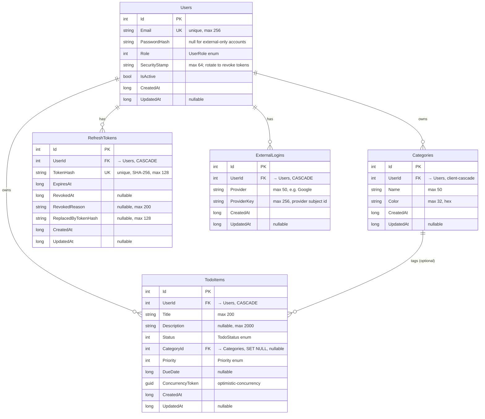

# Database Schema — Tables, Keys & Relationships

_[← Back to the main README](../../README.md)_

The physical data model behind the app: five tables, their columns, keys, indexes, and the
foreign-key cascade rules that make the board behave correctly. The schema is **code-first** —
EF Core generates it from the entities in `src/TodoApp.Domain/Entities` and the mapping in
`src/TodoApp.Infrastructure/Persistence/Configurations`, so this document is a readable mirror of
that source, not a hand-maintained DDL script.

The same model runs on **SQLite** (dev) and **Azure SQL / SQL Server** (prod) via a config-driven
provider switch — see [database portability](database-portability.md) for the provider differences
this schema deliberately accommodates.

---

## Entity-relationship overview

Every table inherits `Id` (int, identity primary key), `CreatedAt` (required), and `UpdatedAt`
(nullable) from `BaseEntity`. Everything is scoped to a `User`: a person only ever sees rows whose
`UserId` is their own (enforced in the application layer — cross-user access returns `404`).

---

## Tables

### `Users`
The account. The `SecurityStamp` is the linchpin of token revocation: it is embedded in every
access token and checked on each request, so rotating it invalidates all outstanding tokens
("sign out everywhere", password change, or account disable).

| Column | Type | Null | Notes |
| ------ | ---- | ---- | ----- |
| `Id` | int (identity) | no | **PK** |
| `Email` | string (256) | no | **Unique index**; stored lower-cased/normalized |
| `PasswordHash` | string | **yes** | Null for accounts that only sign in via an external provider (e.g. Google) |
| `Role` | int | no | `UserRole` enum — `User = 0`, `Admin = 1` |
| `SecurityStamp` | string (64) | no | Random; rotate to revoke all access tokens |
| `IsActive` | bool | no | `false` blocks sign-in immediately |
| `CreatedAt` | long (UTC ticks) | no | |
| `UpdatedAt` | long (UTC ticks) | yes | |

`HasPassword` is a computed helper on the entity and is **not** a column (`builder.Ignore`).

### `TodoItems`
A single card on the Kanban board, owned by a user and optionally tagged with a category.

| Column | Type | Null | Notes |
| ------ | ---- | ---- | ----- |
| `Id` | int (identity) | no | **PK** |
| `UserId` | int | no | **FK → `Users.Id`**, `ON DELETE CASCADE`; indexed |
| `Title` | string (200) | no | |
| `Description` | string (2000) | yes | |
| `Status` | int | no | `TodoStatus` enum — `ToDo = 0`, `InProgress = 1`, `Done = 2` (the board lanes) |
| `CategoryId` | int | **yes** | **FK → `Categories.Id`**, `ON DELETE SET NULL`; indexed |
| `Priority` | int | no | `Priority` enum — `Low = 0`, `Medium = 1`, `High = 2` |
| `DueDate` | long (UTC ticks) | yes | |
| `ConcurrencyToken` | Guid | no | **Optimistic-concurrency token**; regenerated on every save, so a stale update returns `409` |
| `CreatedAt` | long (UTC ticks) | no | |
| `UpdatedAt` | long (UTC ticks) | yes | |

**Indexes:** `UserId`; composite `(UserId, Status)` (the board query — a user's cards by lane);
`CategoryId`. `IsCompleted` is derived from `Status` and is **not** a column.

### `Categories`
A user-defined label with a display color. Each user gets a starter set on sign-up.

| Column | Type | Null | Notes |
| ------ | ---- | ---- | ----- |
| `Id` | int (identity) | no | **PK** |
| `UserId` | int | no | **FK → `Users.Id`**, client-side cascade (see note below); |
| `Name` | string (50) | no | |
| `Color` | string (32) | no | Hex string, e.g. `#4f46e5` |
| `CreatedAt` | long (UTC ticks) | no | |
| `UpdatedAt` | long (UTC ticks) | yes | |

**Unique index:** `(UserId, Name)` — a user can't have two categories with the same name (a
duplicate returns `409`).

> **Why the cascade is client-side.** Deleting a user still removes their categories, but EF Core
> performs that cascade in code (`DeleteBehavior.ClientCascade`) rather than as a DB-level rule.
> `TodoItems` is already reachable from `Users` by a direct cascade, so a *second* database cascade
> path (`Users → Categories → TodoItems`) would trip SQL Server's "multiple cascade paths" error.
> SQLite doesn't enforce that, which is why the issue only surfaced on Azure SQL. See
> [database portability](database-portability.md).

### `RefreshTokens`
One row per issued refresh token. Only the **SHA-256 hash** of the token is stored — never the
token itself. Tokens are single-use and rotated; the `ReplacedByTokenHash` chain is what powers
reuse detection.

| Column | Type | Null | Notes |
| ------ | ---- | ---- | ----- |
| `Id` | int (identity) | no | **PK** |
| `UserId` | int | no | **FK → `Users.Id`**, `ON DELETE CASCADE`; indexed |
| `TokenHash` | string (128) | no | **Unique index**; SHA-256 of the token |
| `ExpiresAt` | long (UTC ticks) | no | |
| `RevokedAt` | long (UTC ticks) | yes | Set on rotation, logout, or revoke-all |
| `RevokedReason` | string (200) | yes | |
| `ReplacedByTokenHash` | string (128) | yes | Hash of the token that superseded this one (rotation chain) |
| `CreatedAt` | long (UTC ticks) | no | |
| `UpdatedAt` | long (UTC ticks) | yes | |

`IsRevoked` / `IsActive` / `IsExpired` are computed methods on the entity, **not** columns.

### `ExternalLogins`
Links a user to an external identity provider (e.g. Google), modeled after ASP.NET Identity's
`AspNetUserLogins` so additional providers can be added without a schema change.

| Column | Type | Null | Notes |
| ------ | ---- | ---- | ----- |
| `Id` | int (identity) | no | **PK** |
| `UserId` | int | no | **FK → `Users.Id`**, `ON DELETE CASCADE`; indexed |
| `Provider` | string (50) | no | e.g. `Google` |
| `ProviderKey` | string (256) | no | The provider's stable subject identifier for the user |
| `CreatedAt` | long (UTC ticks) | no | |
| `UpdatedAt` | long (UTC ticks) | yes | |

**Unique index:** `(Provider, ProviderKey)` — one external identity maps to exactly one user.

---

## Cross-cutting conventions

- **Table names** match the `DbSet<>` property names on `ApplicationDbContext`: `Users`,
  `TodoItems`, `Categories`, `RefreshTokens`, `ExternalLogins`.
- **All timestamps are stored as UTC tick counts (`long`)**, not native date types, via
  `DateTimeOffsetToUtcTicksConverter`. This guarantees correct chronological `ORDER BY`/comparison
  on SQLite (which has no `DateTimeOffset` type) and keeps ordering identical across providers. The
  app writes UTC everywhere (through `IDateTimeProvider`), so reconstructing with a zero offset on
  read is lossless and preserves full 100 ns precision.
- **String lengths** (`HasMaxLength`) map to `nvarchar(n)` on SQL Server and are advisory on SQLite
  (which uses `TEXT`), but keeping them in the model means the SQL Server schema is correctly bounded.
- **Enums are persisted as `int`** (`HasConversion<int>()`), so the numeric values above are what
  actually sit in the column.

## Seed data (first run)

On first launch `DbInitializer` creates the database and seeds a demo account so the app is usable
immediately:

- **Demo user** — `demo@todoapp.local` / `Password123!`
- **Five default categories** — Work, Personal, Errands, Study, Other (the same starter set every
  new user receives via `Category.DefaultsFor`)
- **A few sample todos** spread across the lanes

---

_See also: [Database portability](database-portability.md) · [API reference](api-reference.md) · [Request flow](request-flow.md)._

> **← Back to the main [README](../../README.md).**
