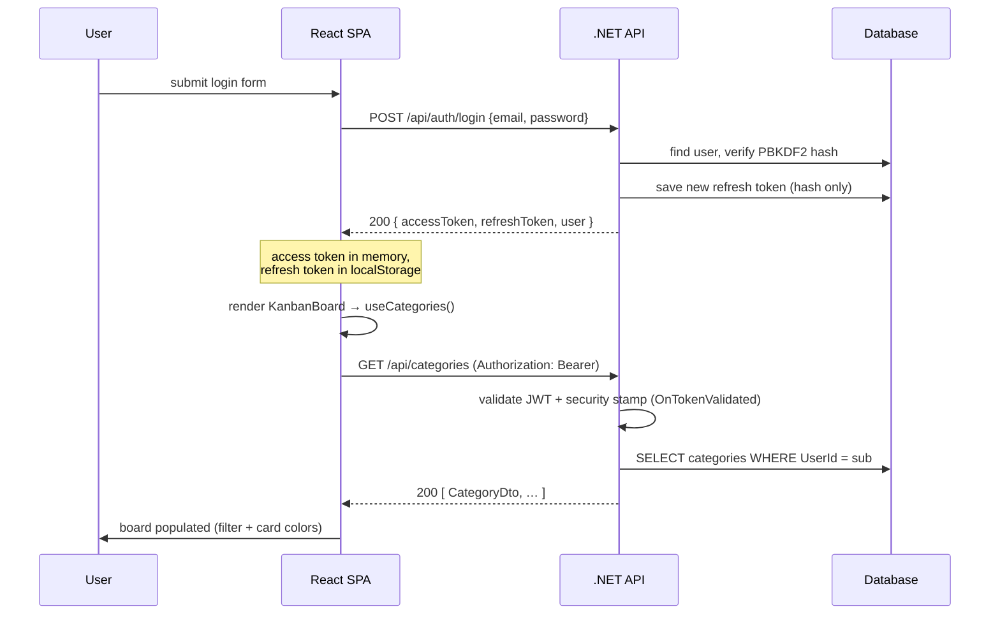

# Request Flow — Login to Board (Worked Example)

_[← Back to the main README](../../README.md)_

One concrete, end-to-end path through the app, traced against the real code: a user signs in, and
the board loads their categories. It shows how the pieces described in the
[tech stack](tech-stack.md) and [architecture assessment](assessment.md) actually fit together at
runtime — the JWT handshake, the per-request security-stamp check, and the user-scoped query.

---

## At a glance

---

## 1. You submit the login form

`AuthForm` calls `App.handleLogin(email, password)`, which calls **`AuthApi.login(email, password)`** in
`lib/apiClient.js`. That fires a `POST /api/auth/login` via `publicPost(...)` — an *unauthenticated*
request (no bearer token yet), just `{ email, password }` in the body.

## 2. The API authenticates you and issues tokens

The `/api/auth/login` endpoint is marked `AllowAnonymous`. It hands the command to MediatR
(`sender.Send(new LoginCommand)`), which first runs the FluentValidation `ValidationBehavior`, then
**`LoginCommandHandler`**:

- Normalizes the email, looks up the user (`_db.Users.FirstOrDefaultAsync`).
- Verifies the password with the **PBKDF2 hasher** (`_hasher.Verify`, fixed-time comparison) and checks
  `user.IsActive`. A bad password or missing user throws `UnauthorizedException` → 401.
- On success, `TokenResponseFactory.Issue(...)` mints a **short-lived JWT access token** (carrying
  `sub`, `email`, `role`, and the user's **security stamp** `sstamp`) plus a **refresh token** (a random
  value; only its SHA-256 hash is saved to the DB). `SaveChangesAsync` persists the refresh token.
- Returns an `AuthResponse`: `{ accessToken, refreshToken, expiries, user }`.

## 3. The frontend stores the session and shows the board

Back in `apiClient.js`, `AuthApi.login` calls **`setSession(auth)`**: the **access token is held in
memory** (a module variable), and the **refresh token is written to `localStorage`** so a page reload
can silently re-authenticate. `App.handleLogin` then does `setUser(auth.user)`. Because `user` is now
set, React swaps `AuthForm` out and renders **`<KanbanBoard />`**.

## 4. The board mounts and fires the categories request

`KanbanBoard` calls two hooks — `useTodos()` and **`useCategories()`**. On mount, `useCategories`'
`useEffect` runs `reload()`, which calls **`CategoryApi.list()`** → `request('/api/categories')`.
(`useTodos` fires `GET /api/todos` at the same moment, so both requests go out together — which is why
serializing token refresh matters; see [Lessons — the real find](../lessons.md).)

## 5. The authenticated request goes out

`request()` builds the call via `doFetch`, which attaches **`Authorization: Bearer <accessToken>`** from
the in-memory token. If the token were expired and the server returned 401, `request()` would call
`refreshSession()` (a single shared in-flight refresh) and retry once — but right after login the token
is fresh, so it sails through.

## 6. The API validates the token before the handler runs

`/api/categories` is under `RequireAuthorization`, so the **JWT bearer middleware** runs first
(`AuthenticationSetup`):

- Validates issuer, audience, signing key, and lifetime. `MapInboundClaims = false`, so raw claim names
  (`sub`, `sstamp`) are used.
- The **`OnTokenValidated` event** does the revocation check: it reads `sub` and `sstamp` from the
  token, loads the user `AsNoTracking`, and confirms the user exists, is active, and that
  **`user.SecurityStamp == sstamp`**. If the stamp was rotated (e.g. "sign out everywhere"), it calls
  `context.Fail(...)` → 401. Here it matches, so the request is authorized.

## 7. The categories query runs, scoped to you

The endpoint sends `GetCategoriesQuery` to **`GetCategoriesQueryHandler`**:

- `_currentUser.UserId` reads your id from the validated token's `sub` claim (via `CurrentUserService`,
  which reads the `HttpContext` principal).
- It queries `Categories.Where(c => c.UserId == userId).OrderBy(c => c.Name)` with `AsNoTracking()` — so
  you only ever get **your own** categories — and maps each to a `CategoryDto` via `FromEntity`.
- Returns `200 OK` with a JSON array.

## 8. The UI populates

`request()` parses the JSON and returns it; `useCategories` does `setCategories(data)`. `KanbanBoard`
re-renders with the categories, which drive the **category filter dropdown** and the **card colors**
(each card resolves its category via `findCategory` and tints the note color). Board populated.

---

## Bonus: the page-refresh path

On a **page refresh** (not a fresh login), steps 1–3 are skipped. `App`'s `useEffect` sees a refresh
token in `localStorage`, calls `AuthApi.refresh()` to get a new access token, then `AuthApi.me()` to
rehydrate the user — and only then renders the board, which triggers the same categories load from step
4 onward. That's why you stay signed in across reloads without re-entering your password.

---

## Files involved

| Step | Frontend | Backend |
| ---- | -------- | ------- |
| Login request | `App.jsx`, `lib/apiClient.js` (`AuthApi.login`, `publicPost`, `setSession`) | `Endpoints/AuthEndpoints.cs`, `Auth/Commands/Login/LoginCommandHandler.cs` |
| Token validation | — | `Authentication/AuthenticationSetup.cs` (`OnTokenValidated`), `Infrastructure/Authentication/CurrentUserService.cs` |
| Categories load | `hooks/useCategories.js`, `lib/apiClient.js` (`CategoryApi.list`, `request`) | `Endpoints/CategoryEndpoints.cs`, `Categories/Queries/GetCategories/GetCategoriesQueryHandler.cs` |

---

_See also: [Tech stack](tech-stack.md) · [Architecture & practices assessment](assessment.md) · [Lessons learned](../lessons.md) · [Testing guide](../development/testing.md)._

> **← Back to the main [README](../../README.md).**
