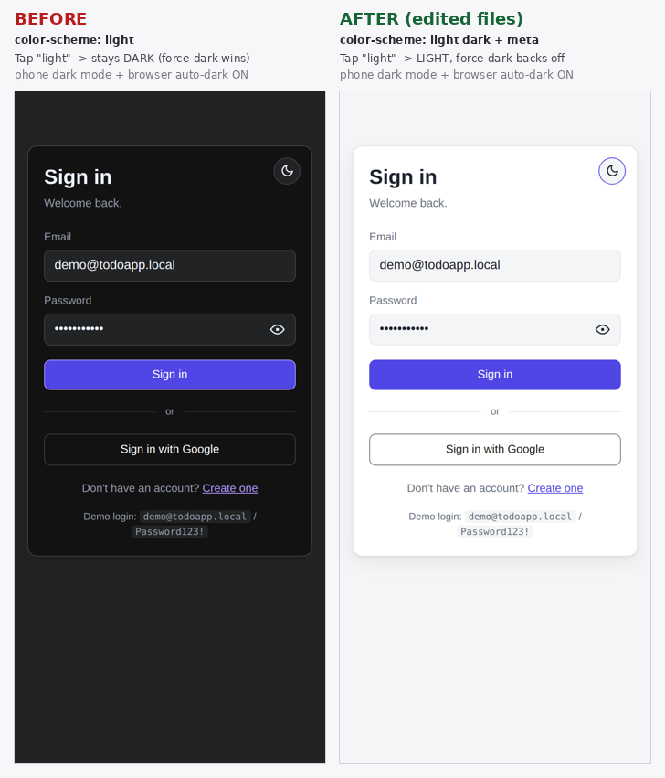

# Frontend & UI engineering notes

App-side engineering lessons from building the React (Vite) client — the ones about
UI behavior and component design rather than deployment. For the deployment, Azure, CI/CD,
database, and config gotchas, see **[Lessons learned](../lessons.md)**.

---

## Frontend (React + Vite)

- **The "post back" when moving a card was a full reload, not a real page post.** Dragging a card between lanes called the API and then re-fetched the whole board, so the UI visibly flashed/reset — it *looked* like a postback. The fix is **optimistic UI**: `useTodos.moveCard` updates local state immediately, then reconciles just the affected card from the server response, and only falls back to a full `reload()` **on error**. The board never flashes on the happy path, and a failed move rolls back cleanly.
- **Keep the optimistic update and the server reconcile in one place.** All todo mutations (move, create, update, delete) live in the `useTodos` hook, not in the view. The view (`KanbanBoard`) just renders and calls hook methods — so the optimistic/rollback logic is written once and is unit-testable.
- **On error, reload *before* setting the error message.** `reload()` calls `setError('')` internally, so if you set the error first and reload after, the reload wipes your message. Order matters: `await reload(); setError(err.message);` — otherwise the user never sees why the action failed. (This is exactly the bug the `useTodos` "reverts by reloading when a move fails" test now guards.)
- **`VITE_*` env vars are build-time**, so anything the SPA needs from config (`VITE_API_URL`, `VITE_GOOGLE_CLIENT_ID`) must be set as GitHub **repository Variables** and baked in at build — see the production-500 triage in [lessons.md](../lessons.md#diagnosing-a-500--failed-request-in-production) for how a wrong `VITE_API_URL` shows up.

## Mobile drag-and-drop — the native HTML5 DnD API is touch-blind

**Symptom:** dragging a card between lanes works fine in a desktop browser but does nothing on a phone browser — the cards can't be picked up at all.

**Root cause:** the board was built entirely on the **native HTML5 Drag and Drop API** — `draggable` cards with `onDragStart` + `e.dataTransfer`, and `onDrop` lanes — with no touch fallback. Those `dragstart` / `dragover` / `drop` events are **mouse-only**; mobile browsers don't synthesize them from touch gestures, so on a phone nothing fires. It's a known limitation of the API, not a device or deploy problem.

**Options considered:**

1. **Switch to a touch-aware drag library** (`@dnd-kit`, or `react-dnd` with a touch backend). Built on Pointer Events, so real drag-and-drop works with mouse, touch, *and* keyboard, and it's accessible. The proper long-term fix, but a larger rewrite of the board's drag wiring plus a new dependency.
2. **Add a tap-to-move control** — a small button on each card that opens the other lanes as tap targets and calls the existing `moveCard(id, status)`. Works on touch and mouse, tiny change, no new dependency. **[chosen]**
3. **A touch polyfill** (`mobile-drag-drop`) that shims HTML5 DnD onto touch events. Smallest code change, but janky and less reliable.

**Decision — option 2 (tap-to-move), because:**

- It's the smallest, lowest-risk change: two component files, no new dependency, `package.json` untouched.
- It **reuses `moveCard()`**, so a tap-move keeps the same optimistic update + concurrency handling as a drag — one code path for every device and every method.
- It works **identically on phone and desktop**, because the control is a plain button and a button's `click` fires the same on a finger tap as a mouse click — which is exactly why it sidesteps the mouse-only DnD limitation.
- Dragging on a small screen is fiddly even when it works, so tap-to-pick-a-lane is arguably *better* mobile UX than real drag.
- Native drag on desktop is left untouched, so desktop users get the tap control *in addition to* dragging.

**Implementation:** `TaskCard.jsx` gained a ⇄ "move" button that reveals the other lanes (excluding the card's current one, each calling `onMove(todo.id, status)`); `Lane.jsx` passes `onMove={onDropCard}` (i.e. `moveCard`) down to each card. No change needed in `KanbanBoard`.

**Trade-off accepted:** actual *dragging* still doesn't work on touch — only the tap control does. If true drag-on-touch is ever wanted, revisit option 1 (`@dnd-kit`).

## Date input — native segments can't backspace across; a typed mask fixes it

**Symptom:** editing a due date, Backspace only cleared the segment the caret was on (month, day, or year) and wouldn't carry across — from the year you couldn't backspace back into the month, and clearing the field entirely was awkward.

**Root cause:** the native `<input type="date">` is **segmented** (`mm | dd | yyyy`), and each segment is its own edit context — the browser owns that behavior, so Backspace/Delete are per-segment by design. A controlled React binding made partial edits worse: clearing a segment left the value momentarily "incomplete", the input reported empty, `onChange` fired with `''`, and React reset the field. There's no way to get continuous editing out of the native control.

**Fix:** a small reusable **`DateField`** component that replaces the native input with a masked **text** field:

- Typing digits auto-inserts the `/` separators (`07192026` → `07/19/2026`), and the caret is preserved across reformatting so **Backspace and Delete flow across the whole field** (year → month, through the slashes) and it can be cleared entirely.
- It validates on completion — an impossible date like `02/30` is treated as empty.
- A **mini-calendar button sits inside the bar**; clicking it opens the browser's native picker via `HTMLInputElement.showPicker()` (with a focus fallback), and picking a day fills the bar.
- It takes and emits a plain `yyyy-mm-dd` string, so the surrounding form/save logic is unchanged.

**Lesson:** native `<input type="date">` is great for free validation and the calendar, but its segmented editing can't be made to behave like free text. When continuous typed editing matters, own the input as a masked text field (and re-add the calendar via `showPicker()`) rather than fighting the native control. Used in `TodoForm` and `TaskCard`.

## Dark/light mode — mobile browsers force-darken a light-only page

**Symptom:** on a phone browser (Chrome / Samsung Internet), choosing **light** mode didn't produce a
light page — it flashed light for an instant and snapped back to dark. Desktop browsers, including
desktop Chrome, were fine, and the in-app toggle worked there.

**Root cause:** Chrome for Android's *Auto dark theme* (and Samsung Internet's dark mode)
algorithmically **invert light pages at paint time** when the OS is in dark mode. When the user
toggles the app to light, the page renders light and the browser immediately re-darkens it — that is
the "flash, then dark" you see. Opting out requires an explicit signal the browser honors, and the
app wasn't sending it.

**The fix that actually works — the `only` keyword.** Per Chrome's
[Auto Dark Theme docs](https://developer.chrome.com/blog/auto-dark-theme), the opt-out is
**`color-scheme: only light`**. Plain `light dark` (or plain `light`) does **not** opt a light page
out of force-dark — it only says "I support both," and the browser still darkens the light state.

- `src/index.css` — the light state's `:root` uses **`color-scheme: only light`**; the dark theme
  keeps `color-scheme: dark`. So light mode tells the browser "render light, do not auto-darken,"
  while dark mode is unaffected.
- `index.html` — a `<meta name="color-scheme">` in `<head>` provides the signal before the
  JS-injected stylesheet loads (reduces the load flash).

**A wrong turn worth recording.** The first attempt used `color-scheme: light dark`, validated
against headless Chromium's auto-dark emulation (`Emulation.setAutoDarkModeOverride`), which rendered
light and *looked* fixed. Real Chrome Android still force-darkened it — the emulation's override is
more lenient than the shipping feature. The emulation is good for *reproducing* the bug, but the
opt-out must be confirmed on a real device, and the documented `only` keyword is what actually counts.

**The breakthrough — fresh load vs. cache.** The fix was confirmed the moment a *fresh* page load (a
newly relaunched browser tab, bypassing cache) rendered light with the browser's auto-dark left **on**,
while the *same* URL opened from an existing/cached entry point still came up dark. That one comparison
did two things at once: it proved `color-scheme: only light` works on a real device with auto-dark
active, and it isolated every remaining "still dark" report as a **caching** problem (a stale
`index.html`), not a code problem — which led directly to the cache-header fix below.

**Caveat — in-app browsers can't be overridden.** This fix stops force-dark in real browsers
(Chrome, Safari, Edge). It does **not** help inside an app's *in-app browser* — e.g. tapping the link
from the LinkedIn or Facebook mobile app opens their built-in browser (Android System WebView), which
the host app can force-dark regardless of any `color-scheme` signal. That darkening hits every website
opened in-app, not just this one, and no site-side change can prevent it; opening the link in a real
browser renders it correctly.

**Lesson:** to keep a light theme from being force-darkened by mobile auto-dark, the light state must
declare `color-scheme: only light` — the `only` keyword is the operative part; `light dark` is not an
opt-out. Verify on a real device, and accept that in-app WebViews are outside a website's control.

## Google sign-in button didn't follow the app theme

**Symptom:** in dark mode the "Sign in with Google" button stayed a bright **white** pill, clashing
with the dark card.

**Root cause:** the button is a **Google-rendered widget** (Google Identity Services). The app's CSS
variables can't restyle it — the only lever is the GIS `theme` option, which was **hardcoded to
`outline`** (the light variant) and read once at mount, so it never tracked the app theme. GIS
offers `outline`, `filled_blue`, and `filled_black`; none of them follow `prefers-color-scheme`.

**Fix (contained to `GoogleButton.jsx`):**

- Derive the theme from the current mode — `theme: dark ? 'filled_black' : 'outline'` — computing
  `dark` the same way `ThemeToggle` does (`<html data-theme>`, falling back to `matchMedia`).
- Because GIS won't restyle an already-rendered button, a **`MutationObserver`** on
  `document.documentElement`'s `data-theme` clears the container and calls `renderButton` again when
  the theme flips (plus a `matchMedia` listener for the system-preference case). Clear the container
  first, or you get a stacked/duplicate button.

**Follow-up — the button changed length on each toggle.** The re-render measured its width from the
container *after* clearing it (momentarily empty), so each redraw came back a slightly different size.
Fixed by measuring a **stable width from the surrounding box before clearing** and caching it, so every
re-render uses the same width.

**Lesson:** third-party rendered widgets don't inherit your theme via CSS — pass their own theme option
and re-render them when your theme changes, but re-render from a *stable* measurement so the widget
doesn't jump. (Verifiable only with a real `VITE_GOOGLE_CLIENT_ID` against a running app, since the
button is Google-rendered.)

## Cache & deploy propagation — stale index.html and in-app browsers

**Symptom:** after deploying a frontend fix, a phone kept showing the *old* build when the site was
opened from an existing link (e.g. a LinkedIn post), even though a fresh load in Chrome showed the new
build. Clearing Chrome's cache didn't fully resolve it.

**Root cause & fix — cache headers.** Vite fingerprints `/assets/*.js` and `.css` (a new filename
every build), so those are safe to cache forever; the real risk is a cached **`index.html`** pinning a
returning visitor to old asset URLs. The deploy set no cache policy, leaving it to defaults. Fixed in
`frontend/staticwebapp.config.json`:

- `globalHeaders` → `Cache-Control: no-cache`, so the HTML shell is always revalidated and a returning
  visitor picks up new deploys immediately.
- a route override for `/assets/*` → `Cache-Control: public, max-age=31536000, immutable`, so the
  fingerprinted bundles still cache long-term.

**Caveat — in-app browsers keep their own cache (and their own dark mode).** Apps like LinkedIn and
Facebook open links in a built-in browser (Android System WebView) with its **own** cache, separate
from Chrome — so clearing Chrome's cache doesn't touch it, and it may serve an old copy until its own
cache expires. This is the same in-app browser that can **force-dark** pages (see the dark/light-mode
note above): the darkening and the caching are the host app's behavior, not the website's, and a site
can neither clear that cache nor override that dark mode. Opening the link in a real browser (Chrome,
Safari, Edge) is the reliable path, and it's what was verified working.

**Lesson:** ship an SPA with `no-cache` on the HTML shell and `immutable` on fingerprinted assets so
deploys propagate to returning visitors; and remember in-app browsers (LinkedIn, Facebook, etc.) have
independent caches and dark-mode behavior a website can neither clear nor override.

## Cold starts — "Waking the server up…" instead of "Failed to fetch"

**Symptom:** the first request after the app had been idle failed instantly with
"Failed to fetch" (or a 502/503/504) — because Azure's Free App Service unloads the API
after ~20 min and the serverless database auto-pauses, so the first hit has to wake them.

**Fix (client side):** all requests go through a `wakeFetch` wrapper in
`src/lib/apiClient.js` that retries **network errors and 502/503/504** with exponential
backoff (~50s) and surfaces a **"Waking the server up…"** message (`App.jsx`,
`AuthForm.jsx`) instead of failing immediately. Other codes (`400/401/403/404/409/500`)
are **not** retried, so real errors still fail fast.

**Lesson:** on a sleep-when-idle host, treat the *network error* and the *gateway* codes
(`502/503/504`) as "warming up — retry with a message," but never the app's own error
codes. The full story (why it happens, the server-side DB retry, and the keep-warm
GitHub Action + free-tier notes) is in
**[Cold starts on the free tier](../deployment/cold-starts.md)**.
