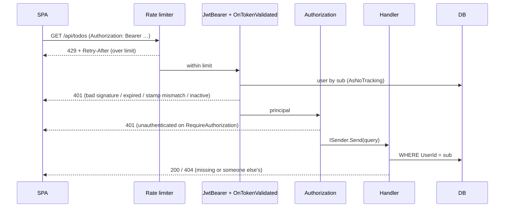

# TaskBoard security for developers

How a request gets from the socket to a user-scoped EF Core query: authentication,
authorization, token revocation and rate limiting, with the code that implements each.

- Slides of the same material: **[auth internals slideshow](../presentations/auth-internals.html)**
- Plain-language version: **[How TaskBoard keeps your tasks safe](for-everyone.md)**
- Endpoint-by-endpoint detail: **[API reference](../architecture/api-reference.md)** ·
  worked trace: **[request flow](../architecture/request-flow.md)**

## Pipeline

```csharp
// src/TodoApp.WebApi/Program.cs
app.UseCors(CorsPolicy);
app.UseRateLimiter();      // 1. reject floods before any crypto work
app.UseAuthentication();   // 2. JWT → HttpContext.User
app.UseAuthorization();    // 3. endpoint policies
app.MapAuthEndpoints();    // 4. handlers filter by the caller's id
app.MapCategoryEndpoints();
app.MapTodoEndpoints();
```

The limiter runs first, so a rejected login never reaches PBKDF2. Swagger is mapped only in
Development. In production the only anonymous surface outside `/api/auth` is `GET/HEAD /`,
a health probe.



## Authentication

### Passwords

`src/TodoApp.Infrastructure/Authentication/PasswordHasher.cs`

- PBKDF2-SHA256, **600,000 iterations**, 128-bit salt, 256-bit key, stored as
  `iterations.salt.key`.
- Verified with `CryptographicOperations.FixedTimeEquals`, so timing doesn't reveal how many
  bytes matched.
- `NeedsRehash` flags older (100k) hashes, which are upgraded to 600k on the next login.
- A wrong password and an unknown email throw the same `UnauthorizedException` → 401, so
  accounts can't be enumerated.

Google sign-in verifies the Google ID token, then issues TaskBoard's **own** tokens. Google
is only an identity source.

### Token model

| | Access token | Refresh token |
| - | ------------ | ------------- |
| Format | HS256 JWT | 32 random bytes (opaque) |
| Lifetime | 15 min (+30 s clock skew) | 7 days, single use |
| Client storage | SPA memory | `todo_rt` cookie: `HttpOnly; Secure; SameSite=None; Path=/api/auth` |
| Server storage | none | SHA-256 hash in `RefreshTokens` |
| Sent as | `Authorization: Bearer …` | cookie + `X-Refresh-CSRF` header |

`SameSite=None` is needed because the SPA (`*.azurestaticapps.net`) and API
(`*.azurewebsites.net`) are different sites. CSRF on `/refresh` is handled by the custom
header: a cross-site form can't send one without a CORS preflight, and CORS allows only the
SPA origin. Tokens are issued by `TokenResponseFactory.Issue`; the cookie is written by
`RefreshTokenCookie`.

### JWT contents

```json
{ "sub": "42", "email": "…", "role": "User", "sstamp": "a1b2c3d4",
  "iss": "TodoApp", "aud": "TodoAppClient", "exp": 1790443717 }
```

The payload is base64url, not encrypted, so claims hold nothing secret. The signature is
HMAC-SHA256 over `header.payload` with `Jwt:Key`. Startup fails fast unless the key is at
least 32 bytes; it comes from user-secrets locally and Key Vault in Azure.

### Validation

`src/TodoApp.WebApi/Authentication/AuthenticationSetup.cs`

```csharp
options.MapInboundClaims = false;   // keep "sub", "role", "sstamp" as-is
options.TokenValidationParameters = new()
{
    ValidateIssuer = true, ValidateAudience = true,
    ValidateIssuerSigningKey = true, ValidateLifetime = true,
    ClockSkew = TimeSpan.FromSeconds(30),
    NameClaimType = "sub", RoleClaimType = "role"
};
options.Events = new JwtBearerEvents
{
    OnTokenValidated = async context =>
    {
        // load the user by "sub" (AsNoTracking)
        if (user is null || !user.IsActive || user.SecurityStamp != stamp)
            context.Fail("This token has been revoked.");
    }
};
```

Four framework checks (issuer, audience, signature, lifetime), then the revocation check.
Any failure leaves `HttpContext.User` unauthenticated, and a protected endpoint returns 401
before the handler runs.

## Authorization

Three layers:

1. **Endpoint.** `.RequireAuthorization()` with no policy name applies the default policy,
   `RequireAuthenticatedUser()`. ASP.NET Core has no separate `RequireAuthentication()`.
   - Whole group: `/api/todos` (`TodoEndpoints.cs`), `/api/categories` (`CategoryEndpoints.cs`).
   - Per route in `AuthEndpoints.cs`: `/logout`, `/revoke-all`, `/me`.
   - `AllowAnonymous`: `/register`, `/login`, `/google`, `/refresh`.
2. **Row.** Every handler filters by the caller's id:

   ```csharp
   // GetTodoByIdQueryHandler.cs
   .FirstOrDefaultAsync(t => t.Id == request.Id && t.UserId == userId, ct)
       ?? throw new NotFoundException(nameof(TodoItem), request.Id);
   ```

   Someone else's resource returns **404, not 403**, so the API never confirms it exists.
3. **Role.** `User` or `Admin` in the `role` claim. Checked inside the handler: only an Admin
   may revoke another user's sessions (`ForbiddenAccessException` → 403). Admins can't read
   other users' todos.

## Refresh and revocation

JWTs are valid until they expire, so revocation needs server state. TaskBoard uses two pieces.

### Security stamp

Each access token embeds the user's `sstamp`, and `OnTokenValidated` compares it with the
database on every request. `User.RotateSecurityStamp()` invalidates every outstanding access
token for that user immediately, on every device. Setting `IsActive = false` has the same
effect. The cost is one primary-key lookup per authenticated request.

### Refresh-token store with rotation and reuse detection

`src/TodoApp.Application/Auth/Commands/RefreshToken/RefreshTokenCommandHandler.cs`

```csharp
var token = await _db.RefreshTokens.FirstOrDefaultAsync(t => t.TokenHash == hash, ct);
// null token, missing user, or inactive user → 401

if (token.IsRevoked)                       // an already-rotated token was replayed
{
    user.RotateSecurityStamp(now);         // kill every access token
    await RevokeAllActiveTokensAsync(user.Id, "Refresh token reuse detected", now, ct);
    throw new UnauthorizedException("Refresh token has been revoked.");
}
if (token.IsExpired(now)) { token.Revoke("Expired", now); /* 401 */ }

token.Revoke("Rotated", now, newRefresh.TokenHash);   // old → new chain
_db.RefreshTokens.Add(new RefreshToken(user.Id, newRefresh.TokenHash, …));
```

Because reuse is treated as theft, the SPA must never refresh twice in parallel.
`apiClient.js` (on the `frontend` branch) shares one in-flight refresh promise across
concurrent 401s. See [lessons](../lessons.md#the-real-find--concurrent-refresh-signed-users-out-everywhere).

### Sign out everywhere

`POST /api/auth/revoke-all` (`RevokeAllTokensCommandHandler`) rotates the stamp and revokes
every active refresh token. A user can revoke their own sessions; an Admin may pass another
user's `userId`.

## Rate limiting

`AddRateLimiter` in `Program.cs`, fixed windows partitioned per client IP, `QueueLimit = 0`.

| Policy | Applies to | Production | Development |
| ------ | ---------- | ---------- | ----------- |
| `auth` | `.RequireRateLimiting(Auth)` on `/api/auth` | 10 / 60 s | 100 / 60 s |
| global | `options.GlobalLimiter`, every request | 200 / 60 s | 200 / 60 s |

Rejected requests get **429**, a Problem Details body, and `Retry-After` taken from the
limiter that actually rejected them. Limits are set under `RateLimiting:Auth` and
`RateLimiting:Global`.

The partition key comes from `ClientAddress.Resolve`:

- With `RateLimiting:TrustForwardedFor=true`, it uses the **last** `X-Forwarded-For` hop,
  which App Service appends. Earlier hops are client-controlled and ignored.
- Addresses are parsed with `IPAddress.TryParse`, then `IPEndPoint.TryParse` (to drop a
  port). Anything else is discarded.
- `appsettings.json` ships `TrustForwardedFor: false`. Behind App Service it must be `true`,
  or every caller shares one partition. Both provisioning scripts set it.

Callers behind one public IP (an office, carrier NAT) share an allowance.

## Status codes

| Code | Meaning here | Raised by |
| ---- | ------------ | --------- |
| 401 | No token, bad signature or claims, expired, revoked stamp, inactive user, bad credentials | JwtBearer, `OnTokenValidated`, `UnauthorizedException` |
| 403 | Authenticated but not allowed (non-admin revoking others) | `ForbiddenAccessException` |
| 404 | Missing **or someone else's** resource | user-scoped query + `NotFoundException` |
| 429 | Rate limit hit, with `Retry-After` | `UseRateLimiter` / `OnRejected` |

## Lessons that shaped this

From [docs/lessons.md](../lessons.md):

- **IPv6 callers were never rate limited.** The old port-stripping code kept the ephemeral
  port for bracketed IPv6 addresses, so every connection got its own partition. Moving the
  logic into `ClientAddress` made it testable; 14 tests now cover it.
- **The whole site shared one partition.** `TrustForwardedFor` shipped `false` and wasn't
  provisioned, so in Azure everyone shared 10 logins a minute.
- **Users were signed out everywhere.** Parallel 401s each triggered a refresh, and the
  replay tripped reuse detection. Fixed with single-flight refresh on the client.

## Where to look

| Concern | File |
| ------- | ---- |
| Pipeline, rate limiter | `src/TodoApp.WebApi/Program.cs` |
| Partition key | `src/TodoApp.WebApi/ClientAddress.cs` |
| JWT validation, stamp check | `src/TodoApp.WebApi/Authentication/AuthenticationSetup.cs` |
| Refresh cookie, CSRF header | `src/TodoApp.WebApi/Authentication/RefreshTokenCookie.cs` |
| Endpoint policies | `src/TodoApp.WebApi/Endpoints/*.cs` |
| Token issuance | `src/TodoApp.Application/Auth/Common/TokenResponseFactory.cs` |
| Rotation, reuse detection | `src/TodoApp.Application/Auth/Commands/RefreshToken/RefreshTokenCommandHandler.cs` |
| Revoke all | `src/TodoApp.Application/Auth/Commands/RevokeAllTokens/RevokeAllTokensCommandHandler.cs` |
| Password hashing | `src/TodoApp.Infrastructure/Authentication/PasswordHasher.cs` |
